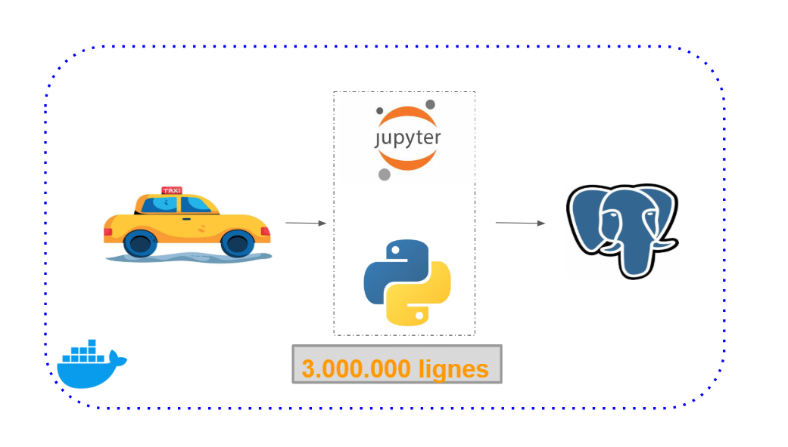

# 🚀 Charger 3 000 000 de lignes dans PostgreSQL avec Python et Docker

Dans cette vidéo, je te montre comment charger **près de 3 000 000 de lignes de données** dans **PostgreSQL** en utilisant **Python**. Tout cela est réalisé sur une **petite machine** Play with Docker (PWD), démontrant ainsi comment manipuler de grandes quantités de données avec des ressources limitées.

YT : https://youtu.be/Qt7uwKo3ms4?si=vJjFudPIpP1JACaP

## 📌 Ce que tu vas apprendre
✔ Comment configurer un **serveur PostgreSQL** avec Docker  
✔ Comment générer et insérer efficacement **des millions de lignes** avec Python  
✔ Comment optimiser les performances lors du chargement de données volumineuses  

## 🛠️ Prérequis
Avant de commencer, assure-toi d’avoir un compte:
- [Docker](https://labs.play-with-docker.com/)

Si tu utilises **Play with Docker**, tout sera mis en place directement via Docker.

## 📦 Installation et exécution
### 1️⃣ Lancer PostgreSQL avec Docker
Exécute la commande suivante pour démarrer un serveur PostgreSQL en conteneur :
```bash
docker run -d -e POSTGRES_USER="root" -e POSTGRES_PASSWORD="root" -e POSTGRES_DB="ny_taxi" -v /root/elproject/dbfolder:/var/lib/postgresql/data -p 5432:5432 postgres:13


